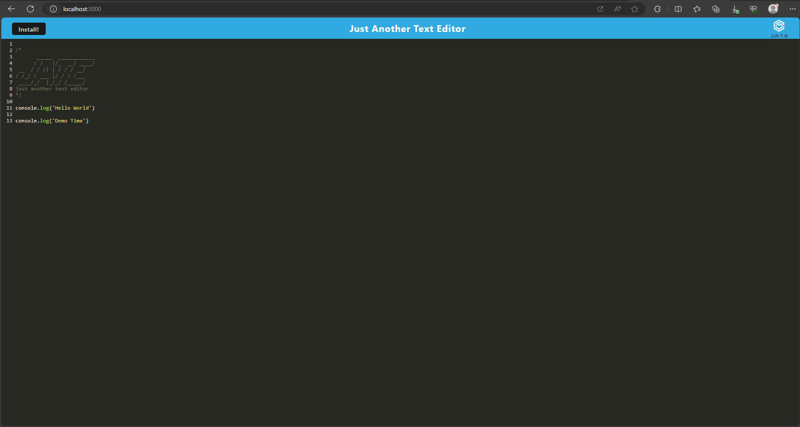

# Text Editor 

# Table of Contents
* [Usage](#usage)
* [Description](#usage)
* [URL](#URL)
* [Screenshots](#Screenshots)
* [Contributors](#contributors)
* [License](#license)
* [Contacts](#contacts)
  
## Usage
This app is a text editor that is allowed to run in a browser
  
## Description
This app includes a landing page that has install button and title and a logo in its header. On the main page is a big JATE title made of underlines and back slahes in each line.
Underneath the big title is a console.log that has a text of "Hello World" and as well as "Demo Time". Jate can be downloaded within the browser and is able to be access from there, you can even create a desktop icon to be in your computer.
  
## URL 
Deployed Heroku Link : https://e-text-editor-app-1119b25fc60c.herokuapp.com/

Github Repository Link : https://github.com/jayP308/e_text_editor

## Screenshots
Main Page

## Contributors
Junnel R. Padilla, UC Berkeley Bootcamp Modules, ChatGPT
  
## License
This project is licensed under [MIT](https://opensource.org/licenses/MIT)

## Questions?
* Name: Junnel R. Padilla
* Github: https://github.com/jayP308
* LinkedIn: https://www.linkedin.com/in/jp-padilla-038854251/